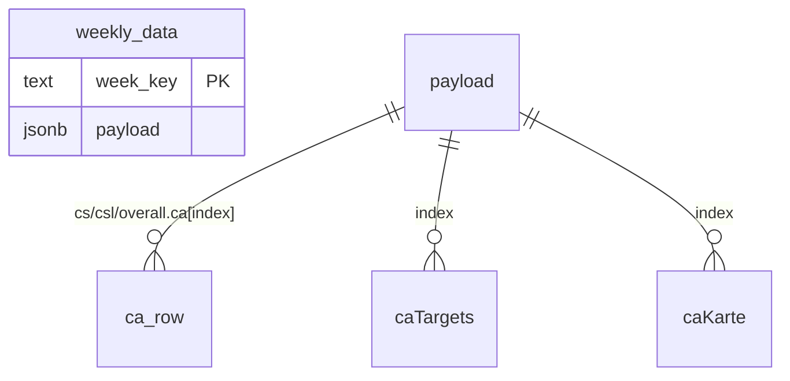

# architecture.md — CAメンバー追加（福田・清野）

**Agent 2: Architect**
入力: docs/spec.md

## 設計方針
CAメンバーは `types/index.ts` の `CA_NAMES` 配列を**単一の真実の源（Single Source of Truth）**とする。UI各所（ログイン・KPI表・目標・カルテ・FB・チャート）は `CA_NAMES.map()` で描画されるため、配列を拡張するだけで自動追従する。

## データモデル
DBは `weekly_data(week_key text PK, payload jsonb)` のJSON payload方式。CAメンバーはpayload内の配列インデックスに連動：
- `overall.ca[i] / cs.ca[i] / csl.ca[i]` … CA別KPI実績
- `caTargets[i]` … CA別目標
- `caKarte[i]` … CAカルテ

インデックス `i` は `CA_NAMES` の順序に一致（0=中村 … 4=福田, 5=清野）。

## APIエンドポイント影響
| メソッド | パス | 認証 | 変更点 |
|---|---|---|---|
| GET | /api/data?week= | anon(RLS) | CA配列補完を `CA_COUNT(=CA_NAMES.length)` 参照に変更。既存4要素payloadを6要素へ自動pad |
| POST | /api/data | anon(RLS) | `caIndex` で福田(4)・清野(5)の行を更新可能（既存ロジックで対応済み） |

## 破壊的変更リスト
- なし（後方互換）。既存の4名payloadは GET 時 `migrate()` が6要素へpadし、不足分は実績0で補完。既存データは保持。

## マイグレーション要否
- **不要**（DBスキーマ変更なし。payloadは可変長JSON）。

## 環境変数の追加・変更
- なし。
